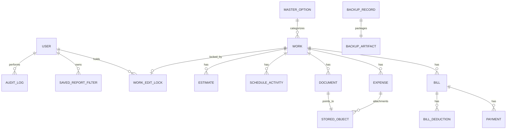
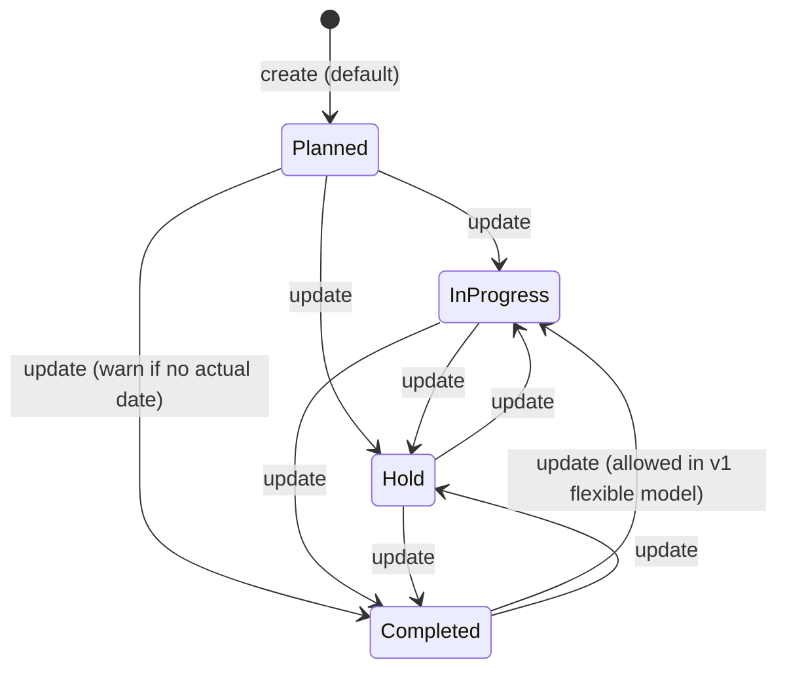
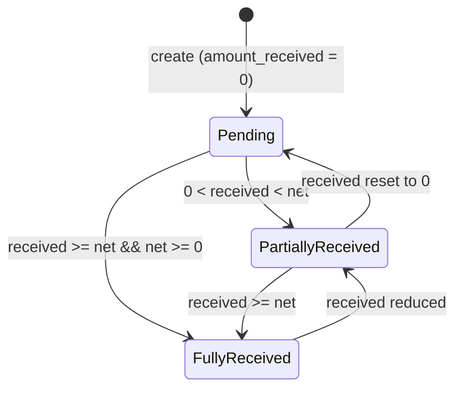
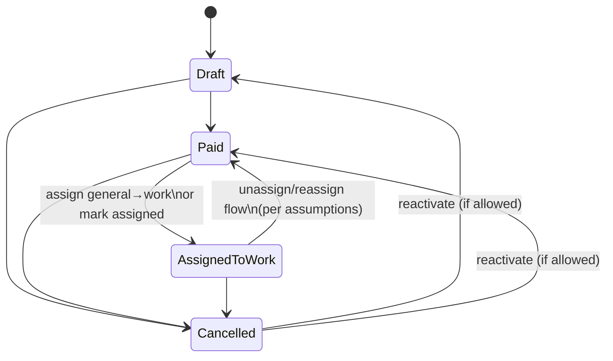
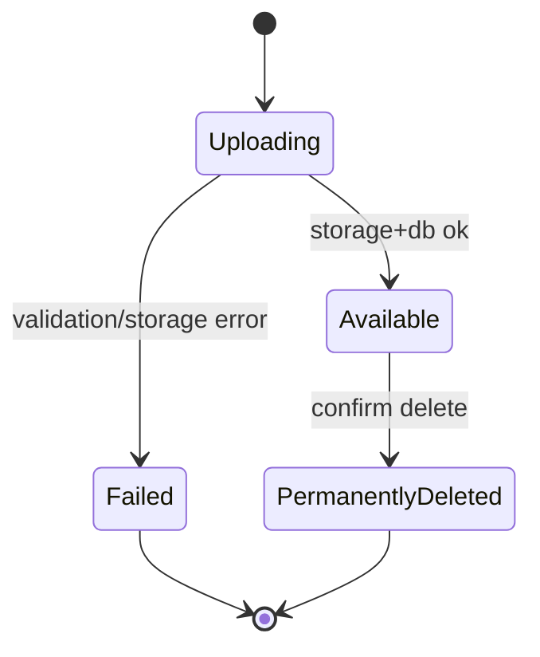
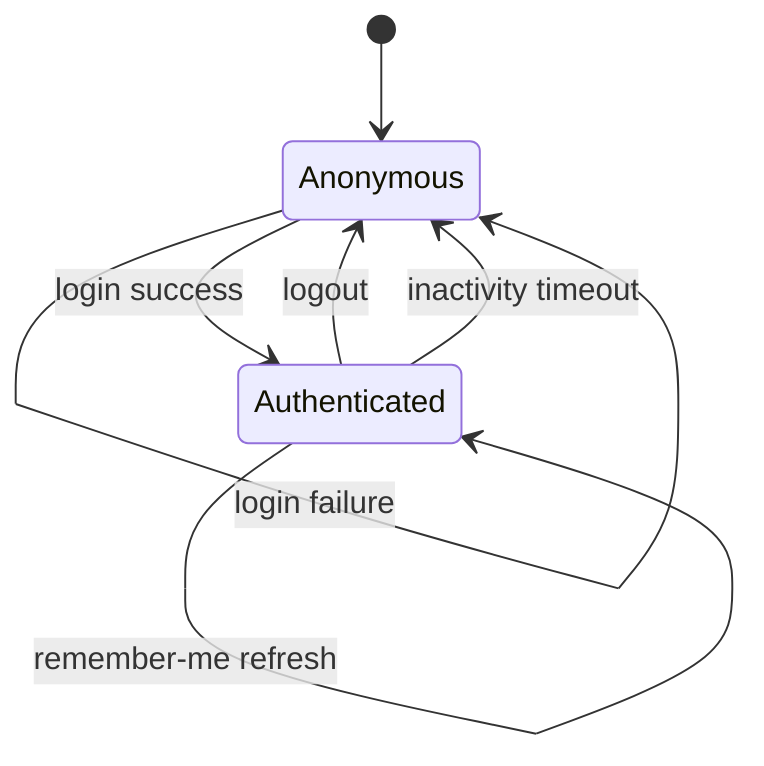
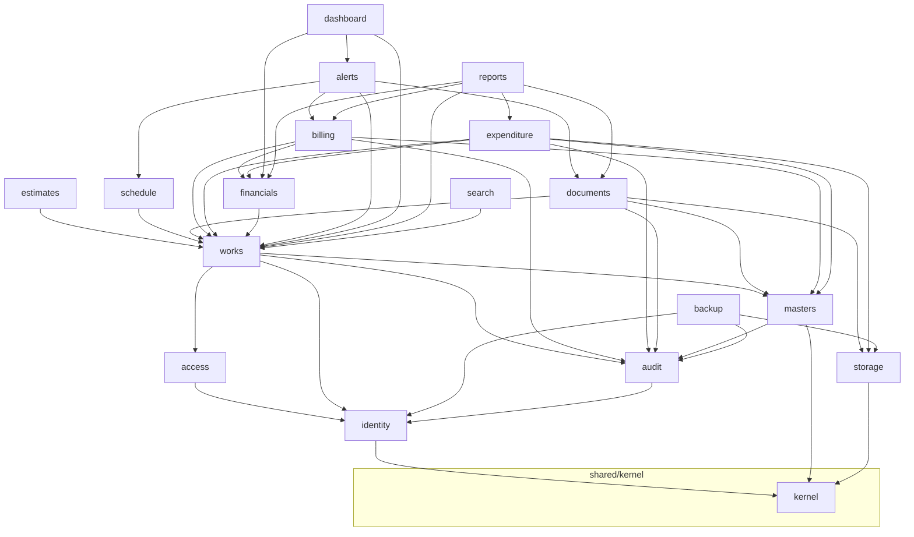

# CWMS Version 1.0 — Software Architecture

**Role:** Principal Software Architect  
**Product:** CWMS – Construction Work Management System  
**Basis:** Product design package Docs 00–15 (`docs/`)  
**Status:** Architecture for engineering kickoff — **no application code in this document**  
**Date:** 2026-07-31  

---

## 0. Executive Architecture Summary

CWMS v1.0 is an **online-only, public-cloud web application** for civil/highway work management. Architecturally it is a **modular monolith** with:

- A **browser client** (SPA) for all UI  
- A **single backend application** exposing HTTP APIs  
- A **relational database** as system of record  
- **Object storage** for document/backup binaries  
- A **scheduler/worker** for weekly backup and retention  

**Work** is the central aggregate. Billing, expenditure, documents, estimates, and schedule attach to Work. There is **no offline client** and **no sync subsystem** in v1.0.

This document defines: system context, logical/physical architecture, domain model (engineering view), module decomposition, repository/project structure, state diagrams, dependency graph, milestones, and development roadmap. It does **not** contain production code.

---

## 1. Architecture Drivers & Constraints

| Driver / Constraint | Architectural implication |
|---------------------|---------------------------|
| Online-only web, any browser/place | Central multi-tenant-ready deployment; HTTPS; session auth; no local DB |
| ~50 concurrent users, ~200 works/year | Modular monolith sufficient; vertical scale first |
| Gross-bills financial integrity | Domain services + DB transactions for bill/expense rollups |
| Work edit lock | Server-side lock store (DB row or cache) with TTL |
| Documents ≤20 MB, PDF/images, copy to storage | Object storage + virus-optional perimeter; never store only local paths |
| Weekly backup, 30-day retention, Admin restore | Scheduled job + restore orchestration with write quarantine |
| Viewer vs full-access + Admin-only ops | Server-side authorization on every mutating endpoint |
| Frozen v1 scope / v2 deferrals | Plugin-ready module folders; no sync/import/BOQ packages in v1 |
| Open questions Doc 14 | Configurable defaults; avoid hard-coding unresolved P0s without flags |

### 1.1 Architecture Style Decision

**Decision:** Modular monolith (single deployable backend + SPA), not microservices for v1.0.

**Rationale:** One team, strong transactional consistency across Work/Bill/Expense, simpler ops on public cloud, adequate scale.

**Future:** Extract reporting/backup workers or document service only if metrics demand it.

---

## 2. System Context

```text
┌──────────────┐     HTTPS      ┌──────────────────────────────────────┐
│  Browser     │───────────────►│  CWMS Web Application (Public Cloud) │
│  (any place) │◄───────────────│  - SPA static assets                  │
└──────────────┘   JSON / files │  - API application                    │
                                │  - Background worker                  │
                                └───────────┬─────────────┬────────────┘
                                            │             │
                                            ▼             ▼
                                   ┌────────────┐  ┌─────────────────┐
                                   │ PostgreSQL │  │ Object Storage  │
                                   │ (primary)  │  │ (docs+backups)  │
                                   └────────────┘  └─────────────────┘
```

**External actors:** Administrator, Data Entry Operator, Engineer, Accounts, Viewer.  
**No:** desktop installer, local SQLite primary, sync agents, native mobile app (v1).

---

## 3. Logical Architecture (Layers)

```text
┌─────────────────────────────────────────────────────────────┐
│ Presentation Layer (SPA)                                      │
│  Screens per Doc 04 · Client validation · Role-aware UI       │
└─────────────────────────────┬───────────────────────────────┘
                              │ HTTPS / JSON
┌─────────────────────────────▼───────────────────────────────┐
│ Application / API Layer                                       │
│  Controllers/Handlers · AuthN/Z · DTOs · Use-case orchestration│
└─────────────────────────────┬───────────────────────────────┘
                              │
┌─────────────────────────────▼───────────────────────────────┐
│ Domain Layer                                                  │
│  Aggregates · Domain services (GST, rollups, alerts, locks)   │
│  Domain events (in-process)                                   │
└─────────────────────────────┬───────────────────────────────┘
                              │
┌─────────────────────────────▼───────────────────────────────┐
│ Infrastructure Layer                                          │
│  ORM/Repos · Object storage · Mail(optional) · PDF/Excel · Jobs    │
│  Clock · Password hashing · File type sniffing                │
└─────────────────────────────────────────────────────────────┘
```

### 3.1 Cross-Cutting Concerns

| Concern | Approach |
|---------|----------|
| Authentication | Server sessions (preferred) or httpOnly secure cookie JWT; Remember Me = long-lived refresh/session |
| Authorization | Role checks in application layer; Viewer deny-all mutations; Admin gates for masters/users/restore |
| Validation | Client UX + server authoritative (Doc 08) |
| Audit | Append-only `audit_log` via domain event hooks |
| Errors | Problem details / consistent error envelope; no partial rollups |
| Logging | Structured app logs + correlation id per request |
| Time | UTC storage; display in IST (or org TZ); FY Apr–Mar helpers |
| Money | Decimal types (not float); round half-up 2 dp |

---

## 4. Physical / Deployment Architecture

```text
                    ┌─ CDN / static hosting (SPA) ─┐
Internet ─ HTTPS ─►│                               │
                    └────────────┬────────────────┘
                                 │ API calls
                    ┌────────────▼────────────────┐
                    │  App Service / Container     │
                    │  (API + optional same-host   │
                    │   worker, or split worker)   │
                    └──────┬──────────────┬───────┘
                           │              │
                    ┌──────▼─────┐ � worker)   │
                    └──────┬──────────────┬───────┘
                           │              │
                    ┌──────▼─────┐ ┌──────▼──────┐
                    │ Managed DB │ │ Object Store│
                    └────────────┘ └─────────────┘
```

**Environments:** `local` · `staging` · `production`  
**Secrets:** cloud secret manager / env — never commit.  
**Backup artifacts:** stored in a separate bucket/prefix from live documents.

---

## 5. Technology Recommendations (ADR Summary)

These are **architecture recommendations** for v1 web delivery (product docs intentionally avoided locking languages earlier). Substitutions are allowed if they preserve the logical architecture.

| Concern | Recommendation | Alternatives acceptable if… |
|---------|----------------|-----------------------------|
| SPA | React + TypeScript (Vite) | Vue/Svelte with same screen map |
| API | Node (Nest/Express) **or** .NET **or** Python (FastAPI) — pick one team-skilled stack | Same modular boundaries |
| DB | **PostgreSQL** managed | MySQL only if team strongly prefers; keep relational |
| ORM | Stack-idiomatic (Prisma/EF/SQLAlchemy) | Raw SQL in repos OK |
| Object storage | **S3-compatible** (per PO) | Azure Blob / GCS with same port interface |
| PDF | Server-side library (e.g. stack-appropriate) | — |
| Excel export | Server-side library (xlsx writer) | — |
| Jobs | Cron / cloud scheduler invoking worker | In-process scheduler for v1 OK |
| Password hash | Argon2id or bcrypt | — |
| Reverse proxy | Cloud load balancer + TLS | — |

**ADR-001 (binding intent):** PostgreSQL + object storage + modular monolith.  
**ADR-002 (binding intent):** All mutations authorized server-side.  
**ADR-003 (binding intent):** Financial rollups in a single DB transaction with the bill/expense write.

---

## 6. Domain Model (Engineering View)

Product domain: Doc 07. Engineering refinements below.

### 6.1 Bounded Contexts (Logical)

| Context | Responsibility |
|---------|----------------|
| Identity & Access | Users, roles, sessions, password policy |
| Work Management | Work aggregate, estimates, schedule, light project names |
| Financials | Bills, deductions, payments, expenses, rollups, P/L |
| Documents | Metadata + object storage lifecycle |
| Reference Data | Masters option lists |
| Reporting | Query models, exports, saved filters |
| Platform Ops | Backup/restore, health, audit |

v1 implements these as **modules inside one process**, not separate services.

### 6.2 Aggregates & Invariants

| Aggregate | Root | Key invariants |
|-----------|------|----------------|
| Work | `Work` | Unique `work_code`, unique `work_order_no`; GST mode consistency; status enum; lock exclusive |
| Bill | `Bill` | Belongs to one Work; unique `system_bill_no`; RA unique per work if present; Gross/Net/Deduction consistency |
| Expense | `Expense` | Work-specific ⇒ work_id required; general ⇒ work_id null until assign; status drives totals |
| Document | `Document` | One work; storage key present after upload; type/size rules |
| User | `User` | Unique login_id; role enum; active flag |
| MasterOption | `MasterOption` | Unique (type, name); delete blocked if referenced |
| Backup | `BackupRecord` | Status success/failed; retention expiry |

### 6.3 Entity Relationship (Logical)



### 6.4 Derived Fields (Computed / Materialized)

Prefer **recompute in transaction** and optionally persist for query speed:

| Field | Formula source (Doc 06) |
|-------|-------------------------|
| `gst_amount`, `total_work_value` | GST Extra / Included rules |
| `gross_bills_raised` | Σ bill.gross |
| `balance_work_value` | total − gross_bills |
| `financial_progress_pct` | gross/total×100 |
| `payments_received` | Σ amount_received |
| `outstanding` | Σ max(net−received,0) |
| `total_expenditure` | Σ qualifying expenses |
| `estimated_profit_loss` | gross_bills − expenditure (until OQ-14-001 changes) |
| `traffic_light` | Rule engine |
| Alert counts | Rule engine queries |

### 6.5 Identity / Numbering Services

| Sequence | Format | Scope |
|----------|--------|-------|
| WorkCode | `CWMS-YYYY-####` | Per calendar year (assumption) |
| SystemBillNo | `BILL-YYYY-####` | Global unique |
| Optional Doc/Exp | `DOC-` / `EXP-` | Global unique |

Implement as transactional sequence table or DB sequences with year prefix logic.

---

## 7. Module Decomposition

### 7.1 Backend Modules

| Module | Package | Responsibilities | Depends on |
|--------|---------|------------------|------------|
| `identity` | users, auth, sessions, password policy | Login, Remember Me, change password, demo seed | shared/kernel |
| `access` | authorization policies | Role gates | identity |
| `masters` | option lists CRUD | 5 master types, in-use checks | shared |
| `works` | work aggregate, project name helpers, lock | CRUD work, GST calc, summary | masters, financials(read), identity |
| `estimates` | estimate CRUD | Child of work | works |
| `schedule` | activities + overdue helpers | Child of work | works |
| `documents` | upload/open/delete | MIME/size, storage port | works, storage |
| `billing` | bills, deductions, payments | Gross/Net, rollup trigger | works, masters |
| `expenditure` | expenses, assign | Totals trigger | works, masters, storage |
| `financials` | rollup service, P/L, progress | Single writer for work financial snapshot | billing, expenditure, works |
| `alerts` | traffic light + 5 alerts | Dashboard queries | works, billing, schedule, documents |
| `dashboard` | KPI aggregation | Read models | alerts, financials, works |
| `reports` | 9 reports, saved filters, PDF/XLSX | Query + export | all read models |
| `search` | global/module search | Indexed fields | works (+ optional others) |
| `backup` | schedule, retain, restore | Jobs + admin API | db, storage |
| `audit` | append log | Hooks | identity |
| `shared/kernel` | money, dates, FY, errors, ids | Utilities | — |
| `storage` | object storage port/adapter | Put/get/delete | infra |

### 7.2 Frontend Modules (Feature Folders)

Mirror screens Doc 04:

`auth` · `shell` · `dashboard` · `works` · `estimates` · `schedule` · `documents` · `billing` · `expenditure` · `reports` · `masters` · `users` · `backup` · `search` · `shared/ui`

### 7.3 Anti-Corruption / Out-of-Scope Packages (Do Not Create in v1)

- `sync`, `offline`, `boq`, `measurement-book`, `excel-import`, `recycle-bin`, `branding-upload`, `notification-centre`

---

## 8. Project / Repository Structure

Monorepo recommended:

```text
CWMS/
├── docs/                          # Product design package (00–15) + architecture/
├── apps/
│   ├── web/                       # SPA
│   │   ├── public/
│   │   ├── src/
│   │   │   ├── app/               # routing, providers
│   │   │   ├── modules/           # feature modules (above)
│   │   │   ├── shared/            # ui kit, hooks, api client
│   │   │   └── styles/
│   │   ├── package.json
│   │   └── …config
│   └── api/                       # Backend modular monolith
│       ├── src/
│       │   ├── main/              # bootstrap
│       │   ├── modules/           # identity, works, billing, …
│       │   ├── shared/            # kernel, errors, auth middleware
│       │   └── infrastructure/    # db, storage, pdf, excel, scheduler
│       ├── migrations/
│       ├── tests/
│       └── …config
├── packages/                      # optional shared types (OpenAPI client)
│   └── api-contracts/             # OpenAPI/JSON schema (design later)
├── worker/                        # OR apps/api worker entry
│   └── src/                       # backup job, retention job
├── deploy/
│   ├── docker/
│   ├── staging/
│   └── production/
├── scripts/                       # seed demos, smoke
├── CHANGELOG.md
└── README.md
```

### 8.1 Module Internal Structure (Backend Convention)

Each backend module:

```text
modules/<name>/
  api/            # HTTP handlers / routes
  application/    # use cases / commands / queries
  domain/         # entities, value objects, domain services
  infrastructure/ # repositories, mappers
  index.ts|py|cs  # public module façade
```

### 8.2 Database Migration Strategy

- Forward-only migrations versioned with app  
- Seed migration: roles enums, demo users, master seeds, branding defaults  
- Upgrade path preserves data (Doc 12)

---

## 9. Key Runtime Flows (Architecture Level)

### 9.1 Save Bill (Transactional)

```text
API → AuthZ (not Viewer)
   → Validate bill (Doc 08)
   → Begin TX
        → Upsert Bill + Deductions (+ Payments)
        → FinancialsService.recalculate(workId)
        → Audit
   → Commit
   → Return DTO (work financial snapshot)
```

### 9.2 Upload Document

```text
API → AuthZ → validate MIME/size
   → Store object (storage.put)
   → Insert Document row (TX)
   → Audit
   → On failure after put: compensating delete object
```

### 9.3 Work Edit Lock

```text
Edit → TryAcquire(workId, userId, ttl)
   → if held by other → 409 + message
   → else return lock token
Save/Cancel/Logout/Timeout → Release
```

Storage: `work_edit_locks(work_id PK, user_id, acquired_at, expires_at)`.

### 9.4 Weekly Backup

```text
Scheduler → BackupService
   → Quiesce optional short lock / use consistent DB snapshot
   → Dump DB + list/copy document objects to backup prefix
   → Integrity check → BackupRecord Success/Failed
   → Purge artifacts older than 30 days
```

### 9.5 Restore (Admin)

```text
Admin → Double confirm
   → Enter maintenance mode (block writes)
   → Restore DB + objects from artifact
   → Invalidate sessions
   → Audit → Exit maintenance
```

---

## 10. State Diagrams

### 10.1 Work Status



### 10.2 Bill Payment Status



### 10.3 Expense Status



### 10.4 Document Lifecycle



### 10.5 Backup Record

```mermaid
stateDiagram-v2
  [*] --> Running
  Running --> Success: integrity ok
  Running --> Failed: error
  Success --> Purged: age > 30 days
  Success --> RestoredIntoLive: admin restore\n(live system changes;\nrecord remains historical)
```



### 10.6 Session / Auth



---

## 11. Dependency Graph

### 11.1 Module Dependencies (Backend)



**Rule:** No circular dependency between `billing` ↔ `expenditure`. Both depend on `financials` for rollups; `financials` may read repositories but must not call billing/expenditure application services (use domain events or direct repo reads inside financials).

### 11.2 Build Order (Implementation Sequence)

```text
1. kernel + infrastructure (db, storage ports)
2. identity + access + audit
3. masters + seeds
4. works + locks + GST domain service
5. estimates + schedule
6. documents
7. financials + billing
8. expenditure
9. alerts + dashboard
10. search
11. reports + exports
12. backup worker + restore
13. hardening, UAT fixes
```

---

## 12. Security Architecture

| Control | Design |
|---------|--------|
| Transport | TLS everywhere |
| Passwords | Argon2id/bcrypt; rules per DEC-28 |
| Sessions | Server-side session store or rotating refresh; Secure/HttpOnly/SameSite cookies |
| CSRF | Cookie+token pattern if cookie sessions |
| AuthZ | Deny by default on mutations for Viewer; Admin capability flags |
| Uploads | MIME sniff + extension allow-list; 20 MB; store outside web root |
| Restore | Admin + double confirm + maintenance mode |
| Secrets | Env/secret manager |
| Audit | Immutable append for sensitive actions |
| PII | Minimal (mobile/email optional on users) |

---

## 13. Data Architecture Notes (No SQL DDL Here)

Conceptual tables (names illustrative):

`users`, `works`, `work_edit_locks`, `estimates`, `schedule_activities`, `documents`, `bills`, `bill_deductions`, `payments`, `expenses`, `master_options`, `saved_report_filters`, `audit_logs`, `backup_records`

Indexes (intent): work_code, work_order_no, bill system/ra numbers, expense dates, document work_id+type, masters (type,name), FY/date query fields.

**Money:** `NUMERIC(18,2)` (or equivalent).  
**Enums:** DB enums or check constraints aligned to Doc 06.

---

## 14. Reporting Architecture

- **Query side:** read models / SQL views optional for heavy reports  
- **Generation:** synchronous for v1 volumes; timeout with clear error  
- **PDF/Excel:** generated server-side; stream download  
- **Saved filters:** JSON payload per user+report  
- **Branding:** static default assets in `deploy`/`assets`  

---

## 15. Quality Attributes & SLOs (Initial Targets)

| Attribute | Target (v1 intent) |
|-----------|--------------------|
| Availability | Best-effort public cloud; communicate outages (no offline mode) |
| API latency (p95 interactive) | < 500 ms for simple CRUD excluding uploads/reports |
| Upload | Support 20 MB within reverse-proxy limits |
| Backup | Weekly success; alert on Failed |
| Restore drill | At least once pre-prod |
| Concurrent users | 50 smoke-tested |

---

## 16. Milestone Plan

### Milestone M0 — Architecture & Skeleton (1 week)

**Exit:** Repo structure, CI lint/test empty harness, DB migrations skeleton, auth middleware stub, storage port fake, deploy-to-staging path sketched.  
**No product features complete.**

### Milestone M1 — Identity & Shell (1–1.5 weeks)

**Exit:** Login/logout, Remember Me, password change/rules, demo seeds, role-aware shell nav, session timeout default, audit login.  
**UAT smoke:** AT-AUTH-* subset.

### Milestone M2 — Masters + Work Core (2 weeks)

**Exit:** Masters CRUD; Work list/create/edit/view; GST Extra/Included; project light; statuses; edit lock; work delete rules; search/filter works.  
**UAT smoke:** AT-WORK-001..006, AT-MST-*.

### Milestone M3 — Estimate & Schedule (1 week)

**Exit:** Child CRUD; overdue contribution to alerts (can finish in M5).  
**UAT:** AT-EST-*, AT-SCH-* (partial alerts OK).

### Milestone M4 — Documents (1–1.5 weeks)

**Exit:** Single/multi upload, open/download, permanent delete, type/size validation, storage integration staging.  
**UAT:** AT-DOC-*.

### Milestone M5 — Billing + Financials Engine (2 weeks)

**Exit:** Bill CRUD, deductions, payments, system bill no, transactional rollups, Gross-based balance/progress, pending/outstanding feeds.  
**UAT:** AT-BILL-*; financial examples Doc 06.

### Milestone M6 — Expenditure (1–1.5 weeks)

**Exit:** Work/general expenses, assign 100%, status totals, attachments.  
**UAT:** AT-EXP-*.

### Milestone M7 — Dashboard & Alerts (1 week)

**Exit:** KPIs, five alerts+drill-down, traffic lights, quick actions.  
**UAT:** AT-DASH-*.

### Milestone M8 — Reports & Exports (1.5–2 weeks)

**Exit:** All 9 reports, saved filters, PDF/Excel, FY Apr–Mar, default branding.  
**UAT:** AT-RPT-*.

### Milestone M9 — Backup/Restore & Hardening (1.5 weeks)

**Exit:** Weekly job, retention 30d, Admin restore+maintenance mode, history UI, security pass, performance smoke (~50 sessions subset).  
**UAT:** AT-BAK-*; regression gate Doc 11 §13.

### Milestone M10 — UAT & Release 1.0.0 (1–2 weeks)

**Exit:** PO UAT script pass; P0 open questions resolved or waived; CHANGELOG; production deploy; demo password policy applied.

**Calendar (indicative):** ~12–16 weeks elapsed depending on team size (1–2 full-stack engineers).

---

## 17. Development Roadmap

### Phase A — Foundation

- Establish monorepo, environments, migrations, CI  
- Implement `identity`, `access`, `audit`, `masters`  
- Define OpenAPI/contract stubs (design-only until coding starts)

### Phase B — Digital Work File

- `works` + locks + GST domain service  
- `estimates`, `schedule`  
- `documents` + storage  

### Phase C — Money Paths

- `financials` service  
- `billing`, `expenditure`  
- Reconciliation tests from Doc 06 examples A–D  

### Phase D — Insight & Governance

- `alerts`, `dashboard`, `search`  
- `reports`  
- `backup` worker  

### Phase E — Release

- Security review checklist  
- Restore drill  
- UAT with realistic dataset (~200 works sample)  
- Production cutover  

### Post-1.0 Tracks (Not in current build)

| Track | Content |
|-------|---------|
| 1.0.x | Defects only |
| 1.1 | UX/search/report polish; optional shortcuts |
| 2.0 | Excel import, logo upload, recycle bin, BOQ, fine permissions, mobile, etc. (Doc 12) |

---

## 18. Testing Architecture (No Code)

| Layer | Focus |
|-------|-------|
| Unit | GST calc, rollup math, password rules, alert predicates |
| Integration | TX bill save+rollup; upload compensating delete; lock TTL |
| API | AuthZ matrix Viewer vs Full vs Admin |
| E2E | Doc 11 happy paths on staging |
| Ops | Backup/restore drill |

---

## 19. Open Architecture Hooks (Awaiting PO — Doc 14)

| Topic | Architecture handling until answered |
|-------|--------------------------------------|
| P/L formula | Implement Gross−Expenditure behind `ProfitLossPolicy` interface |
| Session timeout | Config value default 30m |
| Cascade delete | Default deny; feature flag not exposed |
| Key documents | Config list default WO+Estimate |
| Traffic thresholds | Config constants 30/60 |

---

## 20. Risks Specific to Architecture

| Risk | Mitigation |
|------|------------|
| Monolith module spaghetti | Enforce module façades + dependency rule in review |
| Float money bugs | Decimal-only policy in kernel |
| Storage orphan objects | Compensating transactions + periodic GC job (1.1 OK) |
| Long restore downtime | Maintenance page; communicate RTO |
| SPA/API version skew | Versioned API `/api/v1` |

---

## 21. What We Explicitly Do Not Design Yet

- Detailed OpenAPI endpoint catalogue (next artifact if requested)  
- SQL DDL scripts  
- UI pixel designs (UX owns theme)  
- Infrastructure-as-code full templates  
- Application source code  

---

## 22. Approval

| Role | Sign-off |
|------|----------|
| Principal Software Architect | ☐ Recommended for build |
| Product Owner | ☐ Aligns with Docs 00–15 |
| Engineering Lead | ☐ Feasible with team skills |

---

## 23. References

- `docs/00`–`docs/15` product package  
- Especially: `02` PRD, `06` Business Rules, `07` Domain Model, `08` Validation, `11` Acceptance, `12` Roadmap, `14` Open Questions  

---

**End of CWMS v1.0 Software Architecture**
