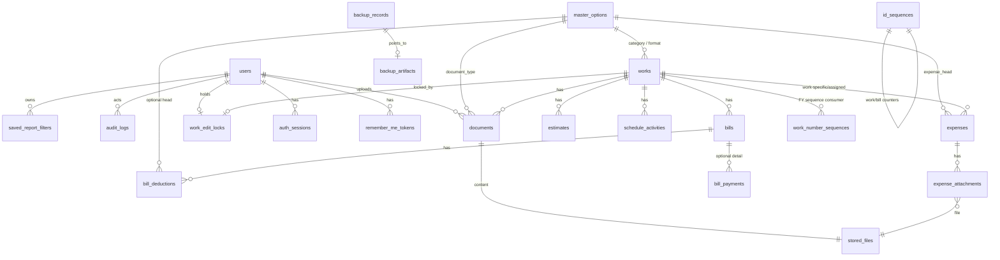

# CWMS v1.0 — SQL Database Design (Architecture)

**Type:** Logical + physical relational design (not implementation)  
**Target RDBMS:** PostgreSQL (ADR-001)  
**Normalization:** Minimum 3NF; justified denormalization noted  
**Companion:** `MIGRATIONS.md`, `../TRACEABILITY.md`, Domain Model `docs/07-domain-model.md`  
**Out of scope:** ORM models, repository code, executable DDL/DML scripts  

Every table lists **Domain Model entity** references (`§2.x` in Doc 07). Business rules that constrain columns reference `BR-*` / `PRD-*`.

---

## 1. Design Principles

| Principle | Application |
|-----------|-------------|
| Work is aggregate root | Child tables FK → `works.id`; Work delete blocked if children exist |
| Money | `NUMERIC(18,2)` — never float |
| Percents | `NUMERIC(9,4)` |
| IDs | `UUID` primary keys (opaque to API clients) |
| Soft delete | Users deactivate (`is_active`); Documents/Bills/Expenses hard-delete per product |
| Free-text parties | Client/contractor/vendor as `TEXT`/`VARCHAR`, not FK masters |
| Project light | `project_name` on Work; distinct names derived, no `projects` table in v1 |
| Files | Binary in object storage; DB holds metadata + storage key only |
| Audit | Append-only `audit_logs`; optional change-history tables deferred |
| Time | `TIMESTAMPTZ` UTC; business dates `DATE` |
| FY | April–March applied in queries/services, not a calendar table in v1 |

---

## 2. Logical ER Overview

### 2.1 Entity-Relationship (Mermaid)

### 2.2 Aggregate Boundaries (Physical Mapping)

| Aggregate | Tables |
|-----------|--------|
| Identity | `users`, `auth_sessions`, `remember_me_tokens` |
| Reference data | `master_options` |
| Work | `works`, `work_edit_locks`, `estimates`, `schedule_activities` |
| Documents | `documents`, `stored_files` |
| Billing | `bills`, `bill_deductions`, `bill_payments` |
| Expenditure | `expenses`, `expense_attachments` (+ `stored_files`) |
| Reporting prefs | `saved_report_filters` |
| Platform | `audit_logs`, `backup_records`, `backup_artifacts`, `id_sequences`, `app_settings` |

---

## 3. Naming & Type Conventions

| Item | Convention |
|------|------------|
| Tables | `snake_case` plural |
| Columns | `snake_case` |
| PK | `id UUID` |
| FK | `{entity}_id` |
| Booleans | `is_*` / `has_*` |
| Enums | PostgreSQL `ENUM` types **or** `VARCHAR` + `CHECK` (prefer CHECK for easier migration) |
| Soft uniqueness | Case-insensitive unique via unique index on `LOWER(col)` where required |

### 3.1 Enumerations (CHECK constraints)

| Name | Values | Domain |
|------|--------|--------|
| `role_code` | Administrator, DataEntryOperator, Engineer, Accounts, Viewer | Role §2.2 |
| `work_status` | Planned, InProgress, Hold, Completed | Work §2.4 |
| `gst_type` | GstExtra, GstIncluded | Work |
| `side_code` | LHS, RHS, Both | Work |
| `traffic_light` | Green, Yellow, Red | Work (derived, stored) |
| `bill_type` | RaBill, FinalBill | Bill §2.9 |
| `payment_status` | Pending, PartiallyReceived, FullyReceived | Bill |
| `expense_type` | WorkSpecific, General | Expense §2.12 |
| `expense_status` | Draft, Paid, AssignedToWork, Cancelled | Expense |
| `payment_mode` | Cash, BankTransfer, Cheque, UPI | Expense |
| `master_type` | WorkCategory, DocumentType, DeductionHead, ExpenseCategory, ClientDepartmentFormat | MasterOption §2.13 |
| `deduction_kind` | Standard, Other | BillDeduction §2.10 |
| `backup_type` | Automatic, Initial | BackupRecord §2.16 |
| `backup_status` | Success, Failed, Running | BackupRecord |
| `report_type` | WorkRegister, Billing, Expenditure, FinancialSummary, WorkWiseSummary, PendingPayment, DocumentRegister, GeneralExpense, DashboardSummary | SavedReportFilter |
| `sequence_kind` | WorkCode, BillNumber, DocumentCode, ExpenseCode | System |

---

## 4. Physical Table Catalogue

> Column nullability: **NN** = NOT NULL. Defaults noted. All money ≥ 0 unless explicitly signed (e.g. estimated P/L may be negative — computed, not stored as column on Work unless cached).

---

### 4.1 `users` — Domain: User §2.1 — PRD-AUTH, PRD-ADM

| Column | Type | Null | Constraints / Notes |
|--------|------|------|---------------------|
| id | UUID | NN | PK |
| name | VARCHAR(200) | NN | |
| login_id | VARCHAR(100) | NN | UNIQUE (case-insensitive index) |
| password_hash | VARCHAR(255) | NN | One-way hash only |
| role_code | VARCHAR(32) | NN | CHECK role_code |
| mobile | VARCHAR(30) | NULL | |
| email | VARCHAR(254) | NULL | |
| is_active | BOOLEAN | NN | DEFAULT TRUE |
| created_at | TIMESTAMPTZ | NN | DEFAULT now() |
| created_by_user_id | UUID | NULL | FK → users (nullable for seed) |
| updated_at | TIMESTAMPTZ | NN | |
| updated_by_user_id | UUID | NULL | FK → users |

**Indexes:** `uq_users_login_id_ci` UNIQUE on `LOWER(login_id)`; `ix_users_role`; `ix_users_active`.  
**Business rules:** BR-SEC-02 (password policy at app), BR-ID-06, BR-SEC-01.

---

### 4.2 `auth_sessions` — Domain: User session (impl of §2.1) — PRD-AUTH

| Column | Type | Null | Constraints |
|--------|------|------|-------------|
| id | UUID | NN | PK |
| user_id | UUID | NN | FK → users ON DELETE CASCADE |
| token_hash | VARCHAR(255) | NN | UNIQUE |
| created_at | TIMESTAMPTZ | NN | |
| expires_at | TIMESTAMPTZ | NN | |
| last_seen_at | TIMESTAMPTZ | NULL | |
| ip_address | VARCHAR(64) | NULL | |
| user_agent | VARCHAR(500) | NULL | |
| revoked_at | TIMESTAMPTZ | NULL | |

**Indexes:** `ix_auth_sessions_user`; `ix_auth_sessions_expires`.

---

### 4.3 `remember_me_tokens` — Domain: User §2.1 Remember-Me — F-AUTH-01A, BR-SEC-03

| Column | Type | Null | Constraints |
|--------|------|------|-------------|
| id | UUID | NN | PK |
| user_id | UUID | NN | FK → users ON DELETE CASCADE |
| token_hash | VARCHAR(255) | NN | UNIQUE |
| created_at | TIMESTAMPTZ | NN | |
| expires_at | TIMESTAMPTZ | NN | |
| revoked_at | TIMESTAMPTZ | NULL | |

---

### 4.4 `master_options` — Domain: MasterOption §2.13 — PRD-ADM, BR-MST-*

| Column | Type | Null | Constraints |
|--------|------|------|-------------|
| id | UUID | NN | PK |
| master_type | VARCHAR(40) | NN | CHECK master_type |
| name | VARCHAR(200) | NN | |
| is_active | BOOLEAN | NN | DEFAULT TRUE |
| sort_order | INT | NN | DEFAULT 0 |
| created_at | TIMESTAMPTZ | NN | |
| updated_at | TIMESTAMPTZ | NN | |
| created_by_user_id | UUID | NULL | FK → users |
| updated_by_user_id | UUID | NULL | FK → users |

**Unique:** `uq_master_type_name_ci` UNIQUE (`master_type`, `LOWER(name)`).  
**Indexes:** `ix_master_type_active`.  
**Delete rule:** Application rejects delete when referenced (BR-MST-02); no ON DELETE CASCADE from children.

---

### 4.5 `works` — Domain: Work §2.4 — PRD-WORK, BR-FIN-*, BR-ID-01/04

| Column | Type | Null | Constraints / Notes |
|--------|------|------|---------------------|
| id | UUID | NN | PK |
| work_code | VARCHAR(20) | NN | UNIQUE; pattern CWMS-YYYY-#### |
| project_name | VARCHAR(200) | NULL | Light ProjectName §2.3 |
| work_name | VARCHAR(300) | NN | |
| work_category_id | UUID | NULL | FK → master_options (WorkCategory) |
| client | VARCHAR(300) | NULL | Free text |
| contractor | VARCHAR(300) | NULL | Free text |
| client_department_format_id | UUID | NULL | FK → master_options |
| work_order_no | VARCHAR(100) | NN | UNIQUE (case-insensitive) |
| work_order_date | DATE | NN | |
| gst_type | VARCHAR(20) | NN | CHECK gst_type |
| work_portion_value | NUMERIC(18,2) | NN | DEFAULT 0; ≥ 0 |
| gst_percent | NUMERIC(9,4) | NN | DEFAULT 0; ≥ 0 |
| gst_amount | NUMERIC(18,2) | NN | DEFAULT 0; ≥ 0 |
| total_work_value | NUMERIC(18,2) | NN | DEFAULT 0; ≥ 0 |
| balance_work_value | NUMERIC(18,2) | NN | DEFAULT 0 | Stored derived (BR-FIN-08..) |
| financial_progress_percent | NUMERIC(9,4) | NN | DEFAULT 0 | Stored derived |
| gross_bills_raised | NUMERIC(18,2) | NN | DEFAULT 0 | Cached rollup |
| payments_received | NUMERIC(18,2) | NN | DEFAULT 0 | Cached rollup |
| outstanding_amount | NUMERIC(18,2) | NN | DEFAULT 0 | Cached rollup |
| total_expenditure | NUMERIC(18,2) | NN | DEFAULT 0 | Cached rollup |
| estimated_profit_loss | NUMERIC(18,2) | NN | DEFAULT 0 | Cached; may be negative |
| state | VARCHAR(100) | NULL | |
| district | VARCHAR(100) | NULL | |
| taluka | VARCHAR(100) | NULL | |
| village | VARCHAR(100) | NULL | |
| existing_chainage | VARCHAR(100) | NULL | |
| design_chainage | VARCHAR(100) | NULL | |
| side_code | VARCHAR(10) | NULL | CHECK side_code |
| structure_type | VARCHAR(200) | NULL | |
| start_date | DATE | NULL | |
| scheduled_completion | DATE | NULL | |
| actual_completion | DATE | NULL | |
| physical_progress_percent | NUMERIC(9,4) | NN | DEFAULT 0; 0–100 |
| status | VARCHAR(20) | NN | CHECK work_status |
| traffic_light | VARCHAR(10) | NN | CHECK; DEFAULT Green | Derived BR-TL-* |
| remarks | TEXT | NULL | |
| created_at | TIMESTAMPTZ | NN | |
| created_by_user_id | UUID | NULL | FK → users |
| updated_at | TIMESTAMPTZ | NN | |
| updated_by_user_id | UUID | NULL | FK → users |

**Indexes:**  
- UNIQUE `work_code`  
- UNIQUE `LOWER(work_order_no)`  
- `ix_works_status`, `ix_works_project_name`, `ix_works_client`, `ix_works_contractor`  
- `ix_works_wo_date`, `ix_works_category`, `ix_works_traffic`, `ix_works_fy` (expression on WO date FY if needed)  
- Full-text / trigram optional: `ix_works_search` on `(work_code, work_name, work_order_no, project_name, client)`  

**3NF note:** Rollup columns are **controlled denormalization** for dashboard/list performance (≤200 works/year scale still OK without them; kept for consistency with architecture). Source of truth remains bills/expenses; recalculated on bill/expense write (BR-FIN-15).

**Delete:** Restricted if any estimate/schedule/document/bill/expense references exist (BR-VAL-04).

---

### 4.6 `work_edit_locks` — Domain: WorkEditLock §2.19 — PRD concurrent lock, BR-CON-01

| Column | Type | Null | Constraints |
|--------|------|------|-------------|
| work_id | UUID | NN | PK, FK → works ON DELETE CASCADE |
| locked_by_user_id | UUID | NN | FK → users |
| acquired_at | TIMESTAMPTZ | NN | |
| expires_at | TIMESTAMPTZ | NN | |
| lock_token | UUID | NN | UNIQUE |

**Indexes:** `ix_work_locks_expires`.

---

### 4.7 `estimates` — Domain: Estimate §2.5 — PRD-EST

| Column | Type | Null | Constraints |
|--------|------|------|-------------|
| id | UUID | NN | PK |
| work_id | UUID | NN | FK → works RESTRICT |
| estimate_no | VARCHAR(100) | NN | |
| estimate_date | DATE | NN | |
| estimated_amount | NUMERIC(18,2) | NN | ≥ 0 |
| revised_estimate | NUMERIC(18,2) | NULL | ≥ 0 |
| approved_by | VARCHAR(200) | NULL | |
| document_id | UUID | NULL | FK → documents SET NULL |
| remarks | TEXT | NULL | |
| created_at | TIMESTAMPTZ | NN | |
| created_by_user_id | UUID | NULL | FK → users |
| updated_at | TIMESTAMPTZ | NN | |
| updated_by_user_id | UUID | NULL | FK → users |

**Indexes:** `ix_estimates_work`; UNIQUE optional (`work_id`, `LOWER(estimate_no)`).  
**Note:** FK to `documents` created after `documents` table (migration order).

---

### 4.8 `schedule_activities` — Domain: ScheduleActivity §2.6 — PRD-SCH, BR-STAT-04/05

| Column | Type | Null | Constraints |
|--------|------|------|-------------|
| id | UUID | NN | PK |
| work_id | UUID | NN | FK → works RESTRICT |
| activity | VARCHAR(300) | NN | |
| start_date | DATE | NULL | |
| finish_date | DATE | NULL | CHECK finish ≥ start when both set |
| actual_start | DATE | NULL | |
| actual_finish | DATE | NULL | |
| progress_percent | NUMERIC(9,4) | NN | DEFAULT 0; 0–100 |
| sort_order | INT | NN | DEFAULT 0 |
| created_at | TIMESTAMPTZ | NN | |
| updated_at | TIMESTAMPTZ | NN | |
| created_by_user_id | UUID | NULL | FK → users |
| updated_by_user_id | UUID | NULL | FK → users |

**Indexes:** `ix_schedule_work`; `ix_schedule_finish` (overdue alerts).

---

### 4.9 `stored_files` — Domain: StoredFile §2.8 — PRD-DOC, BR-DOC-*

| Column | Type | Null | Constraints |
|--------|------|------|-------------|
| id | UUID | NN | PK |
| storage_key | VARCHAR(500) | NN | UNIQUE | Object storage key |
| original_file_name | VARCHAR(255) | NN | |
| content_type | VARCHAR(100) | NN | CHECK pdf/image family |
| size_bytes | BIGINT | NN | CHECK 1..20971520 |
| checksum_sha256 | CHAR(64) | NULL | |
| created_at | TIMESTAMPTZ | NN | |

**Indexes:** `uq_stored_files_key`.

---

### 4.10 `documents` — Domain: Document §2.7 — PRD-DOC

| Column | Type | Null | Constraints |
|--------|------|------|-------------|
| id | UUID | NN | PK |
| document_code | VARCHAR(20) | NULL | UNIQUE optional DOC-YYYY-#### |
| work_id | UUID | NN | FK → works RESTRICT |
| document_type_id | UUID | NN | FK → master_options |
| document_number | VARCHAR(100) | NULL | |
| title | VARCHAR(300) | NULL | |
| stored_file_id | UUID | NN | FK → stored_files UNIQUE (1:1) |
| remarks | TEXT | NULL | |
| uploaded_at | TIMESTAMPTZ | NN | |
| uploaded_by_user_id | UUID | NN | FK → users |
| created_at | TIMESTAMPTZ | NN | |
| updated_at | TIMESTAMPTZ | NN | |

**Indexes:** `ix_documents_work`; `ix_documents_type`; `ix_documents_uploaded`; search on title/number/file name.  
**Delete:** Permanent; cascade delete `stored_files` row + object storage object (app orchestration). BR-DOC-06.

---

### 4.11 `bills` — Domain: Bill §2.9 — PRD-BILL, BR-BILL-*, BR-ID-02

| Column | Type | Null | Constraints |
|--------|------|------|-------------|
| id | UUID | NN | PK |
| system_bill_number | VARCHAR(20) | NN | UNIQUE BILL-YYYY-#### |
| work_id | UUID | NN | FK → works RESTRICT |
| bill_type | VARCHAR(20) | NN | CHECK bill_type |
| ra_bill_no | VARCHAR(50) | NULL | UNIQUE per work when present |
| bill_date | DATE | NN | |
| period_from | DATE | NULL | |
| period_to | DATE | NULL | |
| previous_bill_amount | NUMERIC(18,2) | NN | DEFAULT 0 |
| current_work_portion_amount | NUMERIC(18,2) | NN | ≥ 0 |
| gst_amount | NUMERIC(18,2) | NN | ≥ 0 |
| gross_bill_amount | NUMERIC(18,2) | NN | ≥ 0 |
| total_deductions | NUMERIC(18,2) | NN | ≥ 0 |
| net_bill_amount | NUMERIC(18,2) | NN | |
| payment_status | VARCHAR(30) | NN | CHECK payment_status |
| payment_date | DATE | NULL | |
| amount_received | NUMERIC(18,2) | NN | DEFAULT 0 ≥ 0 |
| outstanding_amount | NUMERIC(18,2) | NN | DEFAULT 0 |
| utr_cheque_no | VARCHAR(100) | NULL | |
| bank_name | VARCHAR(200) | NULL | |
| remarks | TEXT | NULL | |
| created_at | TIMESTAMPTZ | NN | |
| created_by_user_id | UUID | NULL | FK → users |
| updated_at | TIMESTAMPTZ | NN | |
| updated_by_user_id | UUID | NULL | FK → users |

**Unique:** `uq_bills_work_ra` UNIQUE (`work_id`, `LOWER(ra_bill_no)`) WHERE `ra_bill_no IS NOT NULL`.  
**Indexes:** `ix_bills_work`, `ix_bills_date`, `ix_bills_payment_status`, `ix_bills_type`.  
**Check:** `amount_received ≤ net_bill_amount` (or gross per product rule — enforce per BR-BILL payment rules).  
**3NF note:** Payment fields on Bill are the v1 simplification (Domain §2.11); optional `bill_payments` for multi-payment history.

---

### 4.12 `bill_deductions` — Domain: BillDeduction §2.10

| Column | Type | Null | Constraints |
|--------|------|------|-------------|
| id | UUID | NN | PK |
| bill_id | UUID | NN | FK → bills ON DELETE CASCADE |
| deduction_head_id | UUID | NULL | FK → master_options (DeductionHead) |
| name | VARCHAR(200) | NN | Snapshot of head or custom other |
| amount | NUMERIC(18,2) | NN | ≥ 0 |
| kind | VARCHAR(20) | NN | CHECK deduction_kind |
| sort_order | INT | NN | DEFAULT 0 |

**Indexes:** `ix_bill_deductions_bill`.

---

### 4.13 `bill_payments` — Domain: Payment §2.11 (optional detail)

| Column | Type | Null | Constraints |
|--------|------|------|-------------|
| id | UUID | NN | PK |
| bill_id | UUID | NN | FK → bills ON DELETE CASCADE |
| payment_date | DATE | NN | |
| amount_received | NUMERIC(18,2) | NN | ≥ 0 |
| utr_cheque_no | VARCHAR(100) | NULL | |
| bank_name | VARCHAR(200) | NULL | |
| remarks | TEXT | NULL | |
| created_at | TIMESTAMPTZ | NN | |
| created_by_user_id | UUID | NULL | FK → users |

**Indexes:** `ix_bill_payments_bill`.  
**Usage rule:** If used, Bill.amount_received = SUM(payments); else payment columns on `bills` only. Choose one approach at implementation; both tables are defined for completeness. **Recommendation for v1:** payments on `bills` only; keep `bill_payments` out of first migration until multi-payment needed.

---

### 4.14 `expenses` — Domain: Expense §2.12 — PRD-EXP, BR-EXP-*

| Column | Type | Null | Constraints |
|--------|------|------|-------------|
| id | UUID | NN | PK |
| expense_code | VARCHAR(20) | NULL | UNIQUE optional EXP-YYYY-#### |
| expense_type | VARCHAR(20) | NN | CHECK |
| work_id | UUID | NULL | FK → works RESTRICT; required if WorkSpecific |
| expense_date | DATE | NN | |
| expense_head_id | UUID | NN | FK → master_options |
| vendor | VARCHAR(300) | NULL | Free text |
| description | TEXT | NULL | |
| invoice_no | VARCHAR(100) | NULL | |
| invoice_date | DATE | NULL | |
| expense_value | NUMERIC(18,2) | NN | ≥ 0 excl. GST |
| gst_percent | NUMERIC(9,4) | NN | DEFAULT 0 |
| gst_amount | NUMERIC(18,2) | NN | ≥ 0 |
| total_amount | NUMERIC(18,2) | NN | ≥ 0 |
| payment_mode | VARCHAR(20) | NULL | CHECK payment_mode |
| payment_reference | VARCHAR(100) | NULL | |
| payment_date | DATE | NULL | |
| status | VARCHAR(30) | NN | CHECK expense_status |
| created_at | TIMESTAMPTZ | NN | |
| created_by_user_id | UUID | NULL | FK → users |
| updated_at | TIMESTAMPTZ | NN | |
| updated_by_user_id | UUID | NULL | FK → users |

**Checks:**  
- If `expense_type = WorkSpecific` THEN `work_id IS NOT NULL`  
- If `status = AssignedToWork` THEN `work_id IS NOT NULL`  

**Indexes:** `ix_expenses_work`, `ix_expenses_type`, `ix_expenses_status`, `ix_expenses_date`, `ix_expenses_head`, `ix_expenses_vendor`.

---

### 4.15 `expense_attachments` — Domain: Expense attachments §2.12

| Column | Type | Null | Constraints |
|--------|------|------|-------------|
| id | UUID | NN | PK |
| expense_id | UUID | NN | FK → expenses ON DELETE CASCADE |
| stored_file_id | UUID | NN | FK → stored_files UNIQUE |
| created_at | TIMESTAMPTZ | NN | |

**Indexes:** `ix_expense_attachments_expense`.

---

### 4.16 `saved_report_filters` — Domain: SavedReportFilter §2.14 — PRD-RPT, BR-RPT-06

| Column | Type | Null | Constraints |
|--------|------|------|-------------|
| id | UUID | NN | PK |
| user_id | UUID | NN | FK → users ON DELETE CASCADE |
| report_type | VARCHAR(40) | NN | CHECK report_type |
| name | VARCHAR(200) | NN | |
| filters_json | JSONB | NN | Filter payload |
| is_default | BOOLEAN | NN | DEFAULT FALSE |
| created_at | TIMESTAMPTZ | NN | |
| updated_at | TIMESTAMPTZ | NN | |

**Unique:** `uq_saved_filter_user_report_name` (`user_id`, `report_type`, `LOWER(name)`).  
**Partial unique:** at most one default per user/report: UNIQUE (`user_id`, `report_type`) WHERE `is_default`.  
**Indexes:** GIN optional on `filters_json`.

---

### 4.17 `audit_logs` — Domain: AuditLog §2.15 — PRD-AUD, BR-AUD-*

| Column | Type | Null | Constraints |
|--------|------|------|-------------|
| id | UUID | NN | PK |
| occurred_at | TIMESTAMPTZ | NN | DEFAULT now() |
| user_id | UUID | NULL | FK → users SET NULL; null = System |
| user_name_snapshot | VARCHAR(200) | NULL | Denormalized for history |
| module | VARCHAR(50) | NN | |
| action | VARCHAR(80) | NN | |
| details | TEXT | NULL | |
| entity_type | VARCHAR(50) | NULL | |
| entity_id | UUID | NULL | |
| ip_address | VARCHAR(64) | NULL | |
| request_id | VARCHAR(64) | NULL | |

**Indexes:** `ix_audit_occurred`, `ix_audit_user`, `ix_audit_module`, `ix_audit_entity` (`entity_type`, `entity_id`).  
**Rules:** Append-only; no UPDATE/DELETE grants for app role (BR-AUD-02).  
**3NF note:** `user_name_snapshot` justified so rename/deactivation does not erase historical actor label.

---

### 4.18 `backup_records` — Domain: BackupRecord §2.16 — PRD-BAK, BR-BAK-*

| Column | Type | Null | Constraints |
|--------|------|------|-------------|
| id | UUID | NN | PK |
| identifier | VARCHAR(100) | NN | UNIQUE human label |
| backup_type | VARCHAR(20) | NN | CHECK |
| status | VARCHAR(20) | NN | CHECK |
| started_at | TIMESTAMPTZ | NN | |
| finished_at | TIMESTAMPTZ | NULL | |
| retain_until | TIMESTAMPTZ | NULL | started_at + 30 days on success |
| message | TEXT | NULL | |
| created_at | TIMESTAMPTZ | NN | |

**Indexes:** `ix_backup_status`, `ix_backup_retain`.

---

### 4.19 `backup_artifacts` — Domain: BackupArtifact §2.17

| Column | Type | Null | Constraints |
|--------|------|------|-------------|
| id | UUID | NN | PK |
| backup_record_id | UUID | NN | UNIQUE FK → backup_records ON DELETE CASCADE |
| storage_prefix | VARCHAR(500) | NN | Object storage prefix |
| db_dump_key | VARCHAR(500) | NULL | |
| manifest_json | JSONB | NULL | File inventory / checksums |
| size_bytes | BIGINT | NULL | |
| created_at | TIMESTAMPTZ | NN | |

---

### 4.20 `id_sequences` — Domain: System — BR-ID-01, BR-ID-02

| Column | Type | Null | Constraints |
|--------|------|------|-------------|
| sequence_kind | VARCHAR(30) | NN | PK part |
| year | INT | NN | PK part (calendar year of code) |
| last_value | INT | NN | ≥ 0 |
| updated_at | TIMESTAMPTZ | NN | |

**PK:** (`sequence_kind`, `year`).  
**Usage:** Atomic increment in transaction when allocating Work Code / Bill Number.

---

### 4.21 `app_settings` — Domain: BrandingDefaults §2.18 + platform flags

| Column | Type | Null | Constraints |
|--------|------|------|-------------|
| key | VARCHAR(100) | NN | PK |
| value_json | JSONB | NN | |
| updated_at | TIMESTAMPTZ | NN | |

**Seed keys (examples):** `branding.company_name`, `branding.logo_asset_key`, `maintenance_mode`, `backup.schedule_cron`.  
Not user-editable branding in v1 (product default only).

---

## 5. Foreign Key Summary

| Child | Column | Parent | On delete |
|-------|--------|--------|-----------|
| auth_sessions | user_id | users | CASCADE |
| remember_me_tokens | user_id | users | CASCADE |
| works | work_category_id | master_options | RESTRICT |
| works | client_department_format_id | master_options | RESTRICT |
| works | created_by_user_id | users | SET NULL |
| work_edit_locks | work_id | works | CASCADE |
| work_edit_locks | locked_by_user_id | users | RESTRICT |
| estimates | work_id | works | RESTRICT |
| estimates | document_id | documents | SET NULL |
| schedule_activities | work_id | works | RESTRICT |
| documents | work_id | works | RESTRICT |
| documents | document_type_id | master_options | RESTRICT |
| documents | stored_file_id | stored_files | RESTRICT |
| documents | uploaded_by_user_id | users | RESTRICT |
| bills | work_id | works | RESTRICT |
| bill_deductions | bill_id | bills | CASCADE |
| bill_deductions | deduction_head_id | master_options | SET NULL |
| bill_payments | bill_id | bills | CASCADE |
| expenses | work_id | works | RESTRICT |
| expenses | expense_head_id | master_options | RESTRICT |
| expense_attachments | expense_id | expenses | CASCADE |
| expense_attachments | stored_file_id | stored_files | RESTRICT |
| saved_report_filters | user_id | users | CASCADE |
| audit_logs | user_id | users | SET NULL |
| backup_artifacts | backup_record_id | backup_records | CASCADE |

---

## 6. Index Strategy (Summary)

| Purpose | Tables / indexes |
|---------|------------------|
| Uniqueness | login_id, work_code, work_order_no, system_bill_number, storage_key, sequences |
| List filters | works status/project/client/dates; bills payment_status/date; expenses type/status/date |
| Child lookups | All `*_work_id`, `bill_id`, `expense_id` |
| Alerts | schedule finish_date; bills payment_status; works status=Hold |
| Search | Trigram/ILIKE on work identity fields; document title/number; bill numbers |
| Audit | occurred_at DESC; module+action |
| Retention | backup retain_until |

---

## 7. Lookup / Master Tables

Single physical table `master_options` discriminated by `master_type` (Domain §2.13). Seed at first deploy (examples: Drain, Bridge, Work Order, TDS, Labour, etc. — exact seed list from Masters FS).

No separate tables for Client/Contractor/Vendor (free text). No `projects` table in v1.

---

## 8. Audit Tables

| Table | Purpose |
|-------|---------|
| `audit_logs` | Business/security event trail (required) |
| Optional future | `*_history` row versions — **out of v1** |

Application must write audit rows for create/update/delete of Works, Bills, Expenses, Documents, Users, Masters, Restore (BR-AUD-*).

---

## 9. Document Metadata Tables

| Table | Role |
|-------|------|
| `documents` | Business metadata + work link + type |
| `stored_files` | Physical object pointer, MIME, size, checksum |
| `expense_attachments` | Junction for expense files |

Object storage is outside RDBMS; backup artifacts track dump + file manifests.

---

## 10. Migration Ordering (Create)

See `MIGRATIONS.md` for evolution rules. Initial create order:

1. `users`  
2. `auth_sessions`, `remember_me_tokens`  
3. `master_options`  
4. `id_sequences`, `app_settings`  
5. `works`  
6. `work_edit_locks`  
7. `stored_files`  
8. `documents`  
9. `estimates` (after documents for optional FK)  
10. `schedule_activities`  
11. `bills`, `bill_deductions` (+ optional `bill_payments`)  
12. `expenses`, `expense_attachments`  
13. `saved_report_filters`  
14. `audit_logs`  
15. `backup_records`, `backup_artifacts`  

---

## 11. Archival Strategy

| Data | v1 policy |
|------|-----------|
| Operational works/bills/expenses/documents | Remain online; no archive module (Domain: archive not in v1) |
| Audit logs | Retain indefinitely in v1 unless ops volume forces partition by year |
| Backup records | Hard purge after `retain_until` (30 days) — BR-BAK retention |
| Deleted documents | Permanent; no recycle bin |
| Inactive users | Soft-deactivated; retain for FK/audit integrity |

**Future (v2+):** Partition `audit_logs` by year; cold archive completed works older than N years to archive schema — not designed for v1 implementation.

---

## 12. Backup Considerations (Database Design View)

| Concern | Design guidance |
|---------|-----------------|
| Scope | Logical backup = PostgreSQL consistent dump + object-storage document/backup prefixes (PRD-BAK) |
| Frequency | Weekly automatic + initial deploy backup |
| Retention | 30 days; `backup_records.retain_until` drives purge job |
| Consistency | Quiesce writes or use DB snapshot + storage inventory manifest (`backup_artifacts.manifest_json`) |
| Restore | Admin-only; set `app_settings.maintenance_mode`; replace DB + objects; audit restore event |
| RPO/RTO | Product-scale (~200 works/yr) implies modest dump size; exact RPO/RTO ops-owned |
| Secrets | Password hashes included in DB dump; backup storage must be encrypted at rest |
| PITR | Cloud managed PostgreSQL PITR recommended as ops layer **in addition to** weekly product backups |

---

## 13. Integrity & Business Rule Enforcement Layers

| Layer | What |
|-------|------|
| DB constraints | PK/FK/UNIQUE/CHECK/NOT NULL |
| Application services | GST math, rollups, traffic lights, password complexity, master-in-use, work delete policy, lock TTL |
| Jobs | Backup, retention purge, expired session/lock cleanup |

Do not rely on DB alone for BR-FIN / BR-TL / BR-DOC MIME rules.

---

## 14. Domain Model ↔ Table Traceability (Quick Map)

| Domain entity (Doc 07) | Table(s) |
|------------------------|----------|
| User §2.1 | `users`, `auth_sessions`, `remember_me_tokens` |
| Role §2.2 | `users.role_code` CHECK |
| ProjectName §2.3 | `works.project_name` (derived distinct) |
| Work §2.4 | `works` |
| Estimate §2.5 | `estimates` |
| ScheduleActivity §2.6 | `schedule_activities` |
| Document §2.7 | `documents` |
| StoredFile §2.8 | `stored_files` |
| Bill §2.9 | `bills` |
| BillDeduction §2.10 | `bill_deductions` |
| Payment §2.11 | `bills` payment columns and/or `bill_payments` |
| Expense §2.12 | `expenses`, `expense_attachments` |
| MasterOption §2.13 | `master_options` |
| SavedReportFilter §2.14 | `saved_report_filters` |
| AuditLog §2.15 | `audit_logs` |
| BackupRecord §2.16 | `backup_records` |
| BackupArtifact §2.17 | `backup_artifacts` |
| BrandingDefaults §2.18 | `app_settings` |
| WorkEditLock §2.19 | `work_edit_locks` |
| (System IDs) | `id_sequences` |

---

## 15. Approval Record

| Item | Value |
|------|-------|
| Document | SQL Database Design v1.0 |
| Status | Draft for engineering handoff |
| Implementation scripts | Explicitly excluded |
